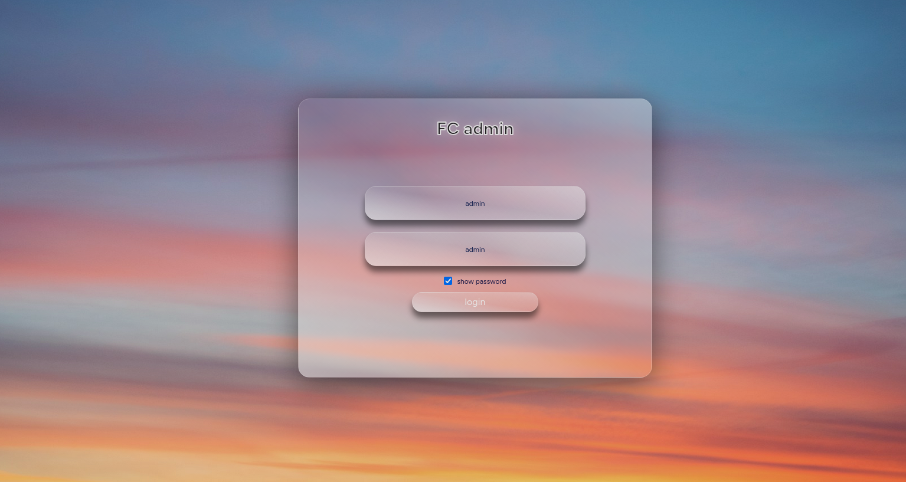
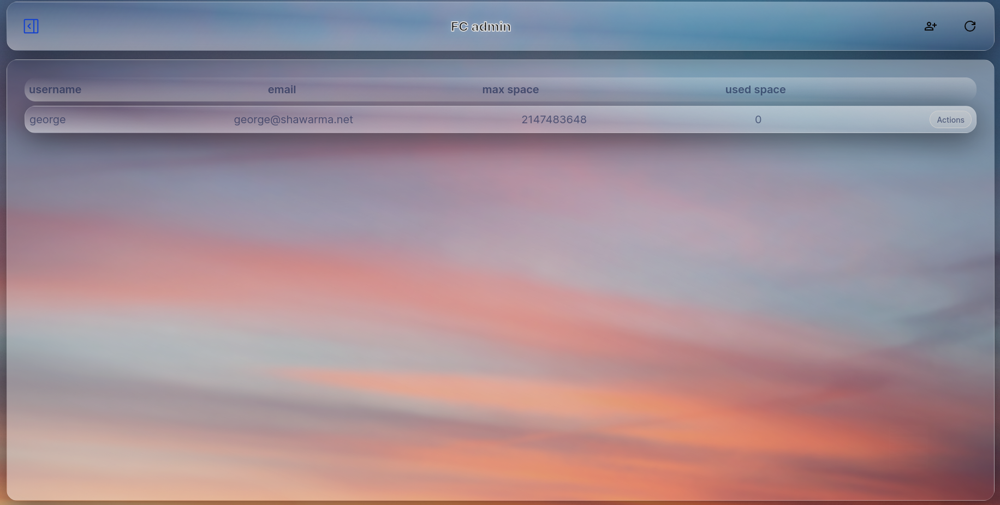
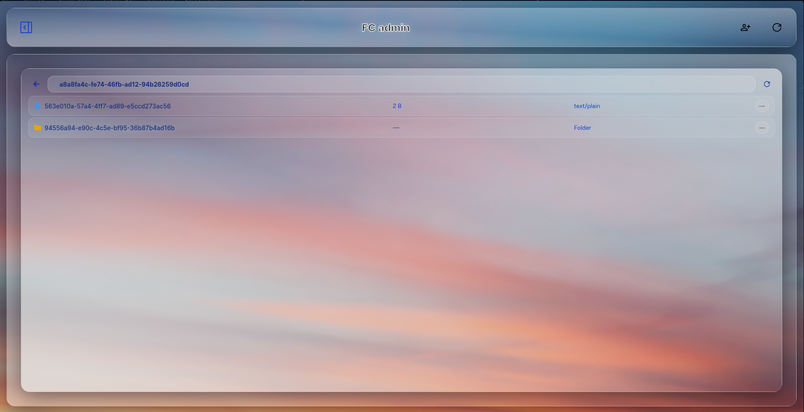

# Family Cloud Admin Dashboard

An admin dashboard designed specificly to enable the admins to control stored users,data and objects on a deployed instance.

## features

- Add new user manually.
- remove users.
- force logout all users.
- delete stale file/folder in RustFS.
- file browser: to browse user files.

## pictures

